# 基于WanAndroid实现的Flutter客户端

## 前言

> 项目是为了掌握flutter的基本功能去尝试开发的一款WanAndroid客户端。 

> 在学习 `Flutter` 的过程中，收集了一些很好的学习网站以及插件，以便日后学习。

> 如果你觉得这个 `APP` 不错，或者这个项目有帮助到你，不妨点个 `Star or Fork` 吧 ^_^

## Flutter 学习资源汇总

- [Dart 官方网站](https://dart.dev/)
- [Dart 编程语言中文网](http://dart.goodev.org/)
- [Flutter 官方网站](https://flutter.dev/)
- [Flutter 中文网](https://flutterchina.club/)
- [Flutter 官方 Demo](https://github.com/flutter/flutter/tree/master/examples/flutter_gallery)
- [Flutter 社区中文资源](https://flutter.cn/)
- [Flutter 教程](https://guoshuyu.cn/home/wx/Flutter-1.html)
- [在线 Json to Dart](https://javiercbk.github.io/json_to_dart)

## API
[**玩 Android 开放 API**](http://www.wanandroid.com/blog/show/2)

## 项目截图

| 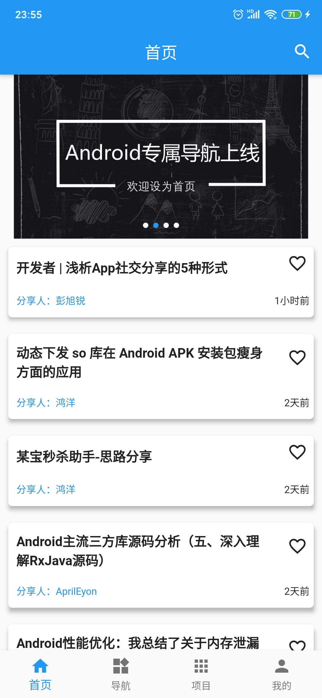 | 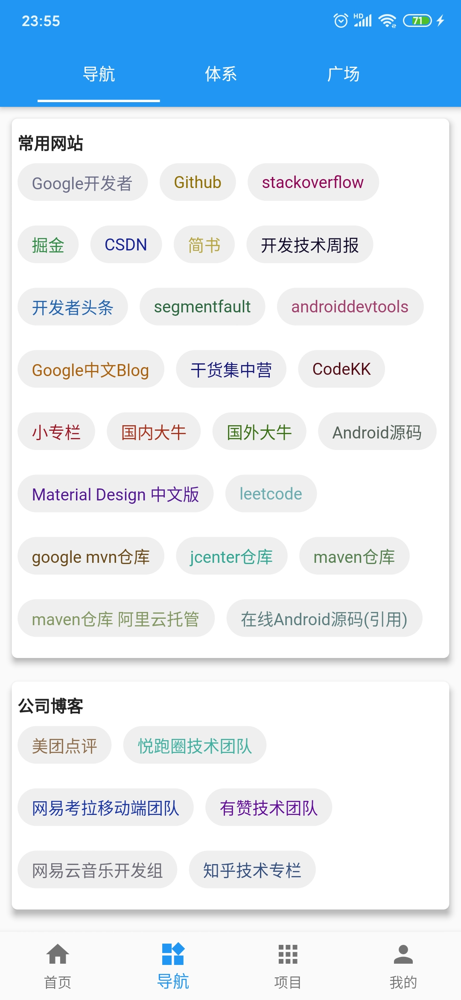 | 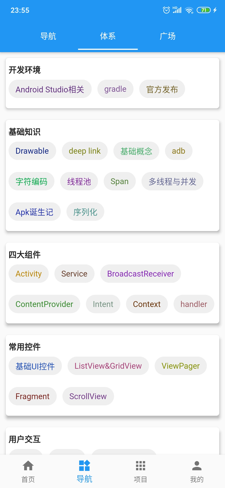 | 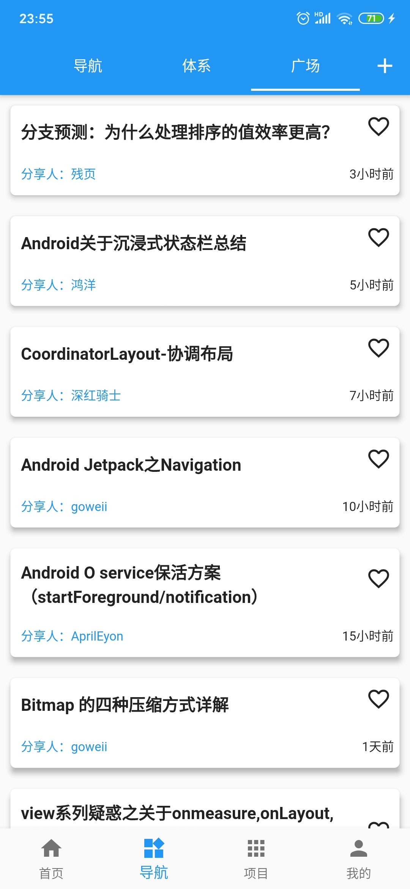 |
| --- | --- | --- | --- |
| 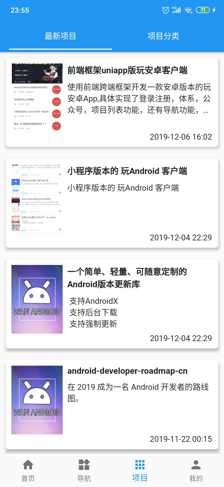 | 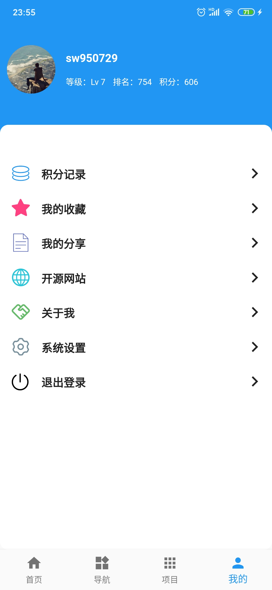 | 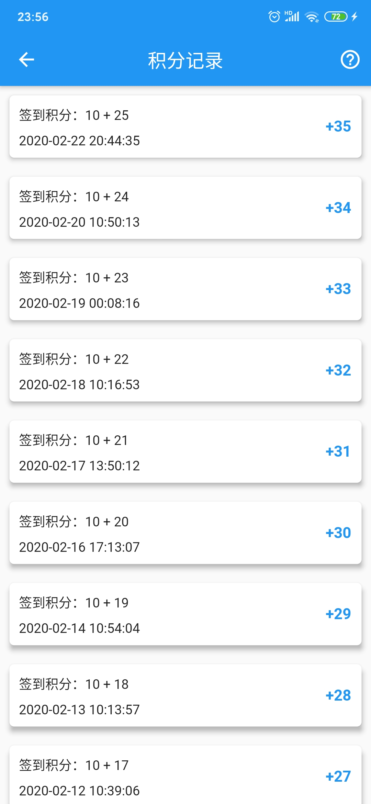 | 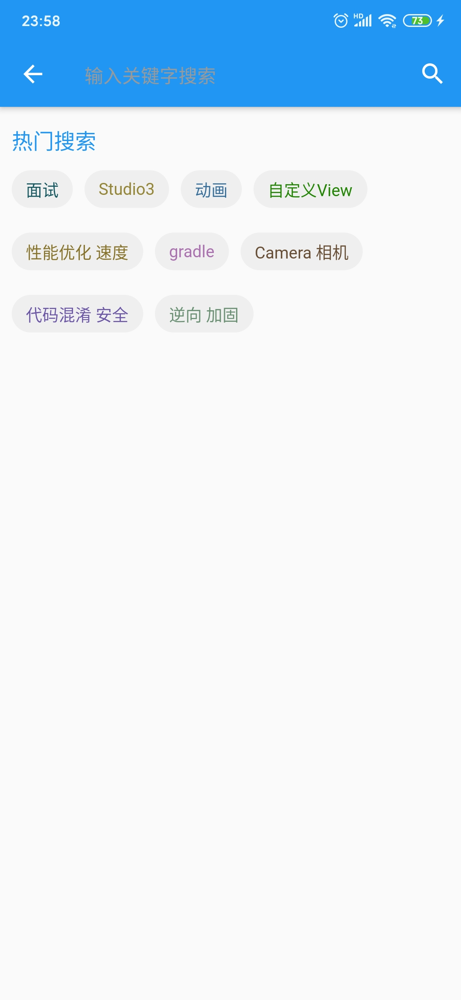 |
| 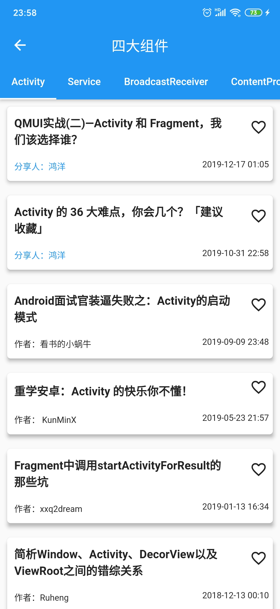 | 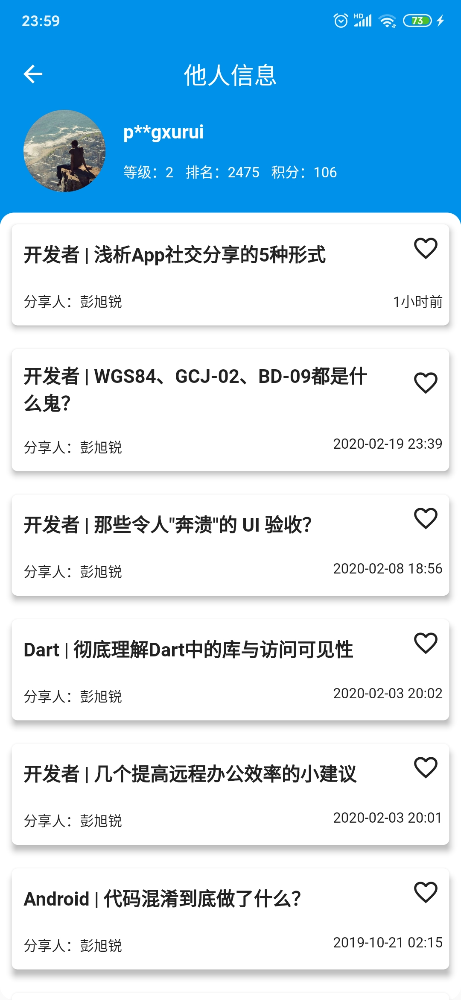 | 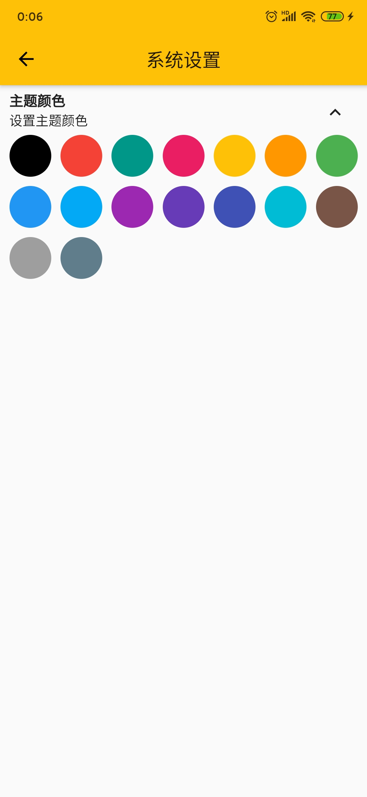 | 

## 下载体验

- **Android**
    - 点击[download](https://github.com/sw950729/WanAndroid_Flutter/raw/master/android/app/release/app-release.apk)下载

## 主要功能

- 首页、导航、体系、广场、项目、个人中心；
- 登录注册功能；
- 搜索功能：热门搜索；
- 收藏功能：添加收藏、取消收藏；
- 浏览文章、分享文章；
- 我的积分、积分记录；
- 我的分享、分享人的分享列表；
- 自定义切换主题颜色功能；
- 关于模块;

## 主要开源库

- [dio](https://github.com/flutterchina/dio): 网络库
- [shared_preferences](https://pub.dartlang.org/packages/shared_preferences): 数据存储
- [flutter_swiper](https://github.com/best-flutter/flutter_swiper): 轮播图
- [fluttertoast](https://github.com/PonnamKarthik/FlutterToast): 吐司
- [cached_network_image](https://github.com/renefloor/flutter_cached_network_image): 图片缓存
- [provide](https://github.com/rrousselGit/provider): 状态管理

## 更新日志

## Statement

**项目中的 API 均来自于 [www.wanandroid.com](http://www.wanandroid.com/) 网站，纯属学习交流使用，不得用于商业用途。**

## END
项目会持续迭代更新，如有任何疑问和建议请提 [Issues](https://github.com/sw950729/WanAndroid_Flutter/issues) 或联系 WeChat： **724727508** 。
最后欢迎关注我的公众号：码农职场

## Getting Started

This project is a starting point for a Flutter application.

A few resources to get you started if this is your first Flutter project:

- [Lab: Write your first Flutter app](https://flutter.dev/docs/get-started/codelab)
- [Cookbook: Useful Flutter samples](https://flutter.dev/docs/cookbook)

For help getting started with Flutter, view our
[online documentation](https://flutter.dev/docs), which offers tutorials,
samples, guidance on mobile development, and a full API reference.
